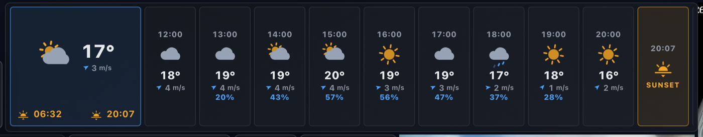
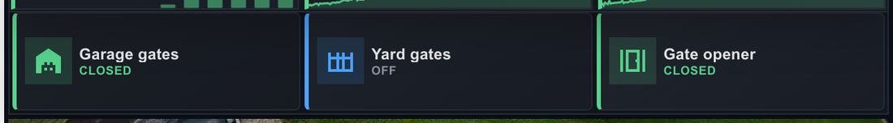

# PZM Home Dashboard

A Home Assistant OS add-on that drives a wall-panel / kiosk dashboard.


## What it does

- Multiple **RTSP camera streams** — the C# backend transcodes them on demand
  to low-latency HLS, and the browser plays them with hls.js. Streams are
  started per-camera only while a tile is on screen, and torn down after.
- A live **Solar / Grid / House card** driven by your Home Assistant Solax
  Modbus entities, with an animated flow diagram over an isometric render of
  your house, draggable value callouts, and today / month / 12-month history
  pulled from HA's long-term statistics.
- A **Home Security panel** with big one-tap buttons for user-configurable
  gates, live open/closed contact state, alarm arm / disarm, and an optional
  zone list (doors, windows, motion, gas, fire, glass-break).
- A **weather card** — current conditions plus an hourly forecast strip with
  wind, precipitation probability, and sunrise / sunset, using the
  coordinates HA already knows for your home.
- **PTZ control** for cameras that support it, with named preset recall.
- **Light control** including brightness, colour and RGBIC pattern/effect
  selection for strips.
- A **generic tile system** — add any HA entity as a button, number, or
  light tile through an entity picker and icon catalogue.
- A **drag / resize tile editor** with alignment snap guides, plus layout
  backup and restore.

Everything is laid out on one shared grid. The layout lives server-side and
syncs live to every open client, so re-arranging tiles on your phone moves
them on the wall panel at the same time.

> **Note on form factor:** this is built for a fixed landscape wall panel and
> is best viewed at 16:9 (1920×1080 or similar). The grid scales rather than
> reflows, so narrow phone viewports are not currently supported.

### The full panel

Eight camera tiles alongside the energy, weather and security cards. The
camera feeds below are **deliberately blurred** — they are live views of a
private home; everything else is exactly as it renders.


### Weather

Current conditions, then an hourly strip carrying temperature, wind,
precipitation probability, and the sunset marker.



### Security

One-tap gates with live contact state, next to alarm arm / disarm.



## Install as a HAOS add-on

1. In Home Assistant → **Settings → Add-ons → Add-on Store → ⋮ → Repositories**,
   paste the URL of this Git repository and click **ADD**.
2. Refresh the add-on store. **PZM Home Dashboard** appears in a new section.
3. Click it, then **INSTALL**. First install pulls the .NET 8 SDK + Node 20 +
   ffmpeg base images and takes a few minutes.
4. Open the **Configuration** tab and fill in:
   - **cameras** — one entry per RTSP source. Fill in `url`, `username`,
     `password`, `transport` (`tcp` or `udp`).
   - **home_assistant.solar** — the entity IDs for your inverter. Defaults
     match the [wills106 solax_modbus](https://github.com/wills106/homeassistant-solax-modbus)
     naming for a Gen4 X3-Hybrid. Change any that differ.
   - **home_assistant.security** — set `alarm_panel` to your
     `alarm_control_panel.*` entity, and edit each `gates` entry so `entity`
     points to the switch / button / cover / script that triggers your gate.
     Any of those domains works — the backend picks the correct service
     (`switch.turn_on`, `button.press`, `cover.open_cover`,
     `script.turn_on`, `input_boolean.turn_on`, `lock.unlock`). Add
     `contact:` (a `binary_sensor` entity) to show open/closed state. The
     shipped `zones` list is two placeholder examples — replace them with
     your own, or empty the list to hide the zone section.
   - Leave `home_assistant.use_supervisor: true`, and leave `base_url` and
     `token` blank — the supervisor injects a scoped token via
     `homeassistant_api: true`.
5. **Start** the add-on. Once healthy, click **OPEN WEB UI**.
6. Drag / resize any tile via the **Edit** button (bottom-right of the
   dashboard). The layout is stored server-side in `/data/layout.json` and
   pushed to every connected client over Server-Sent Events, so it is shared
   across browsers and devices rather than per-browser — edit on a phone,
   watch the wall panel update. Use **Backup layout** in the side menu to
   export or restore it as JSON.

### Custom house image

The Electricity card overlays live callouts (`Solar`, `PV 1`, `PV 2`, `Home`,
`Grid`) on top of an image at `/house.png` (served from
`pzm_home_dashboard/frontend/public/`). Drop your own transparent-background
isometric render there; if you keep the aspect ratio close to 2682 × 1600 the
callout positions in `pzm_home_dashboard/frontend/src/components/SolarCard.jsx`
map cleanly to the roof panels / garage / fence corner. Otherwise adjust the
numbers inside `<HouseView>`.

## Repository layout

```
repository.yaml                    HAOS add-on repository manifest
pzm_home_dashboard/                The add-on itself
  config.yaml                        HAOS add-on manifest
  Dockerfile                         Multi-stage build (Node → .NET → runtime + ffmpeg)
  run.sh                             Add-on entrypoint
  backend/                           ASP.NET Core 8 API
    Program.cs                         DI, LAN-only middleware, static SPA host
    Controllers/
      CamerasController.cs             /api/cameras · /{id}/snapshot
      HlsController.cs                 /hls/{camera}/index.m3u8 · /{segment}
      HomeAssistantController.cs       /api/ha/solar[/history|/daily|/monthly]
                                       /api/ha/weather · /api/ha/ptz[/select]
      SecurityController.cs            /api/ha/security · /alarm · /gate/{i}
      EntitiesController.cs            /api/ha/entities · /entity/{state,history,action}
      LayoutController.cs              /api/layout (GET/PUT) · /events (SSE)
    Services/                          StreamManager (ffmpeg-per-camera),
                                       HomeAssistantClient, WeatherService,
                                       CameraSnapshotService, CameraRegistry,
                                       LayoutStore
    Models/
  frontend/                          React 18 + Vite + hls.js
    src/
      App.jsx                        Shared grid, layout sync, tile seeding
      components/
        CameraTile.jsx               HLS video tile
        SolarCard.jsx                HouseView + animated energy flow
        SecurityCard.jsx             Alarm, gates and zone chips
        WeatherCard.jsx              Current conditions + hourly strip
        PtzCard.jsx                  PTZ preset recall
        LightControl.jsx             Brightness / colour / RGBIC patterns
        SimpleTile.jsx               Generic button / number / light tiles
        TileEditor.jsx               Drag, resize and snap guides
        EntityPicker.jsx             HA entity search
        IconPicker.jsx               Inline SVG icon catalogue
        SideMenu.jsx                 Settings, layout backup / restore
        SecurityOptions.jsx          Gate and zone configuration
        PullToRefresh.jsx
      lib/                           color, entityStates, layoutRepair,
                                     placement, poll
    public/
      house.png                      Isometric house image (drop your own here)
```

## Local development

The backend loads `appsettings.Development.json` on top of `appsettings.json`
when `ASPNETCORE_ENVIRONMENT=Development`. Both files are read from the
`backend/` directory. Development is git-ignored, so put your real HA token
and camera passwords there.

```bash
# One-time setup (macOS)
brew install ffmpeg dotnet@8

# Backend
cd pzm_home_dashboard/backend
ASPNETCORE_URLS=http://0.0.0.0:8099 \
ASPNETCORE_ENVIRONMENT=Development \
HLS_ROOT=/tmp/pzm-hls \
dotnet run --no-launch-profile

# Frontend (in another shell)
cd pzm_home_dashboard/frontend
npm install
npm run dev   # http://localhost:5173/
```

Vite proxies `/api` and `/hls` to `:8099` so both work seamlessly.

`pzm_home_dashboard/frontend/src/components/SolarCard.jsx` fetches history for
`hours = hours-since-local-midnight` from `/api/ha/solar/history`. `Total Solar`
uses the long-term-statistics WebSocket API (`recorder/statistics_during_period`)
and shows 12 monthly bars.

## Home Assistant configuration reference

Everything the add-on reads is available under the `Dashboard` section of
`appsettings.json` (see the template) or via HAOS options (see
`config.yaml`). Both shapes bind to the same
`PzmHomeDashboard.Models.DashboardOptions`.

## License

Personal project, no license granted yet.
